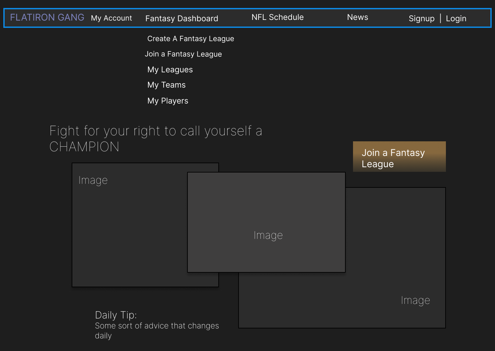
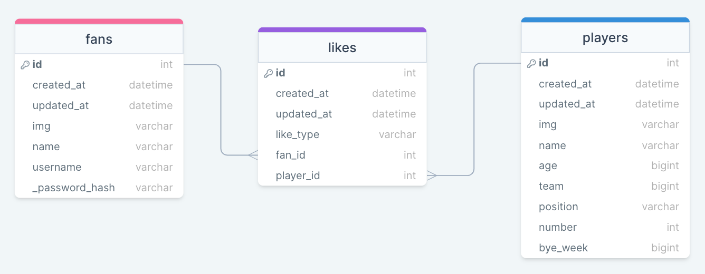

# Flatiron Gang

#### Explore the ultimate fantasy football management experience with our app, where you can draft, strategize, and build the team of your dreams to compete in leagues with family & friends for the right to call yourself a CHAMPION

---

## Wireframes

---

## User Stories

Users should:

Create and personalize my fantasy football team by selecting players from a variety of teams and positions.

Have a user-friendly interface that allows me to readily navigate through the app's various sections, such as team management, league standings, and player statistics.

Access a comprehensive player database containing detailed player profiles, historical performance data, and expert analysis to facilitate strategic decision-making.

Participate in weekly matches
Compete against other teams in League

Receive alerts and updates regarding player injuries, lineup changes.

A User can:

- GET all users
- GET user by id
- DELETE user by id
- GET, POST, and UPDATE their fantasy team
- GET all players
- GET player by id
- GET all games
- GET gamesd by id

---

## Entity Relationship Diagram

## API Routes

## Trello

