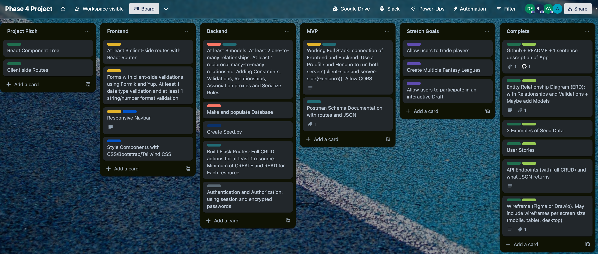

# Flatiron Gang NFL Lover

#### Indulge in your NFL obsession with 🏈 Flatiron Gang NFL Lover! Sign up with us and let the NFL fun begin! Be the 🏆 champion of your Fantasy football league by searching our NFL player data base and liking your favorite NFL players. You'll be ahead of the game and ready for that much anticipated Fantasy Football Draft.

---

## Wireframes

---

## User Stories

A Users can:

- Signup for a user account on Flatiron Gang NFL Lover App
- Login to user account
- Search through a database of NFL players by player name and see the player's information.
- Like their favorite NFL players
- update name on user account
- Logout of user account

---

## React Tree

## 

## Client Side Routes

| **Client Route** | **Component** |
| ---------------- | ------------- |
| /                | Home.js       |
| /account         | Account.js    |
| /mylikes         | MyLikes.js    |
| /players         | AllPlayers.js |
| /players/:id     | Player.js     |
| /auth            | Auth.js       |

---

## Entity Relationship Diagram

---

## API Routes

| API Route      | Request Method | Body                            | Response                                               |
| -------------- | -------------- | ------------------------------- | ------------------------------------------------------ |
| /players       | GET            |                                 | [{...},{...},...]                                      |
| /players/:id   | GET            |                                 | {id, img, name, age, team, position, number, bye_week} |
| /likes         | GET            |                                 | [{...},{...},...]                                      |
| /likes         | POST           | {like_type, fan_id, player_id}  | {id, like_type, fan_id, player_id}                     |
| /likes/:id     | GET            |                                 | {id, like_type, fan_id, player_id}                     |
| /likes/:id     | DELETE         |                                 | {}                                                     |
| /fans          | GET            |                                 | [{...},{...},...]                                      |
| /fans          | POST           | {name, img, username, password} | {id, name, img, username}                              |
| /fans/:id      | GET            |                                 | {id, name, img, username}                              |
| /fans/:id      | PATCH          | {name, image}                   | {id, name, img, username}                              |
| /fans/:id      | DELETE         |                                 | {}                                                     |
| /login         | POST           | {username, password}            | {id, name, img, username}                              |
| /check_session | GET            |                                 | {id, name, img, username}                              |
| /logout        | DELETE         |                                 | {}                                                     |

---

## Trello

